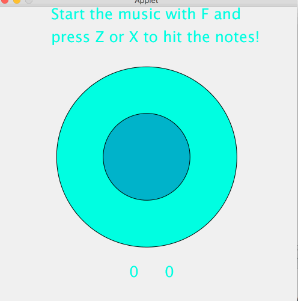

# rhythmrail
A rhythm game made for ClojureBridge Seoul with Quil
Goal is to hit the circles with Z or X on the rhythm of the beat!

## Usage
Add the .wav music file to your ~/ (home) directory.

LightTable - open `core.clj` and press `Ctrl+Shift+Enter` to evaluate the file.

Emacs - run cider, open `core.clj` and press `C-c C-k` to evaluate the file.

REPL - run `(require 'rhythmrail.core)`.

## License

Copyright © 2017

Distributed under the Eclipse Public License either version 1.0 or (at
your option) any later version.
